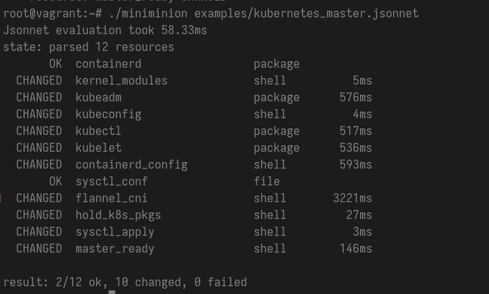

# Miniminion (minim)

Simple pull-based(for now only for local running, without pulling state from the control plane) configurations management system (alternative for salt, puppet, chef, etc.). 

Minim uses jsonnet for declarative state description.

## Concepts

Minim has a core concepts familiar to users of other popular cm systems, like Salt, Puppet and others.

- *Resource*: an entity through which any host element (file, package, systemd unit, etc.) is controlled.
- *State*: direct acyclic graph of resources.
- *Sensors*: bpf programs for a resource that monitor it's state, logging all kernel change operations to obtain drift.

## TODO

- [ ] implement a fact-like mechanism in the state compilation runtime.
- [ ] add more relation types for resources (not only dependencies) such as "requires" in the saltstack.
- [x] add a bpf sensors layer for tracking resources state by tracing some kernel events (for example running fexit for sys_write on a file, that controlled by the minim resource)
- [ ] implement a drift checker/watcher for resources and overall state, that utilizes sensors layer
